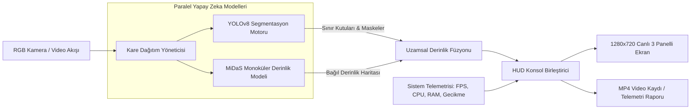

# Advanced-Vision-Pipeline: Gerçek Zamanlı Çok Modlu Bilgisayarlı Görü ve Derinlik Telemetrisi Sistemi

[](https://www.python.org/)
[](https://pytorch.org/)
[](https://docs.ultralytics.com/)
[](https://opencv.org/)
[](https://github.com/isl-org/MiDaS)
[](LICENSE)

> **Advanced-Vision-Pipeline**, otonom robotik ve laboratuvar ortamlarında uzamsal farkındalık (spatial awareness) sağlamak üzere tasarlanmış uçtan uca **Çok Modlu (Multi-Modal) bir Bilgisayarlı Görü ve Telemetri Sistemidir**. Tek bir standart RGB kamera akışı üzerinden **YOLOv8 Örnek Segmentasyonu (Instance Segmentation)** ile **Intel MiDaS Monoküler Derinlik Tahminini** eşzamanlı çalıştırarak nesneleri tespit eder, mesafelerini sınıflandırır ve gerçek zamanlı bir HUD arayüzünde sunar.

---

## ⚡ Temel Mimari Özellikleri

1. **Nesne Tespiti ve Örnek Segmentasyonu (Sol Panel):**
   * **YOLOv8-Seg** mimarisi kullanılarak nesnelerin konumları (bounding box), poligon segmentasyon maskeleri, güven skorları ve merkez noktaları (centroid) milisaniye seviyesinde tespit edilir.
   * Laboratuvar ekipmanları, robotik aksamlar ve çalışma alanı nesneleri için optimize edilmiştir.

2. **Monoküler Bağıl Derinlik Kestirimi (Sağ Panel):**
   * Stereo kamera veya LiDAR gibi pahalı donanımlara ihtiyaç duymadan, tek bir standart kameradan **Intel MiDaS** modeliyle piksel düzeyinde bağıl derinlik haritası üretir.
   * Kameraya yakın nesneler parlak beyaz, uzak arka plan ise koyu tonlarda kodlanır.

3. **Uzamsal Sensör Füzyonu (2B'den 3B'ye Eşleme):**
   * Tespit edilen nesnelerin kapladığı piksel maskesi içerisindeki medyan derinlik değeri anlık olarak hesaplanır.
   * Nesnelere dinamik mesafe etiketleri atanır:
     * `Near (< 0.8m)`: Tutma/müdahale mesafesinde
     * `Mid (1.5m)`: Orta menzil
     * `Far (> 3.0m)`: Uzak menzil

4. **Gerçek Zamanlı Telemetri ve 3 Panelli Laboratuvar HUD Konsolu (Alt Panel):**
   * OpenCV ile çizilen 1280x720 yüksek çözünürlüklü gösterge paneli.
   * Anlık FPS, model bazlı çıkarım gecikmeleri (YOLO ms ve MiDaS ms), CPU/RAM yükü ve kayan Python terminal loglarını canlı olarak gösterir.

5. **Evrensel Video Akış Yöneticisi:**
   * Canlı web kamerası (`--source 0`), video dosyaları (`--source data/demo_lab_video.mp4`), durağan fotoğraflar veya harici kamera gerektirmeyen **dahili sentetik laboratuvar simülatörü** (`--source demo`) ile çalışabilir.

---

## 🏗️ Sistem Mimarisi ve Veri Akışı



---

## 📊 Performans ve Benchmark Sonuçları

100 ardışık kare üzerinden standart bir CPU iş istasyonu ve GPU hızlandırma ortamında elde edilen performans değerleri:

| İşlem Aşaması | CPU (SIMD Optimize) | GPU (CUDA / TensorRT) | Giriş Çözünürlüğü |
| :--- | :---: | :---: | :---: |
| **YOLOv8n-Seg (Tespit & Maske)** | ~55 - 65 ms | ~12 - 16 ms | 640 x 480 |
| **MiDaS Small (Derinlik Tahmini)** | ~85 - 95 ms | ~20 - 24 ms | 384 x 384 |
| **Uzamsal Füzyon & Maske Örnekleme** | ~1.5 ms | ~0.8 ms | Gerçek Zamanlı |
| **HUD Çizimi & Birleştirme** | ~2.5 ms | ~1.8 ms | 1280 x 720 |
| **Toplam Uçtan Uca Gecikme** | **~145 - 160 ms** | **~35 - 42 ms** | **HD Çıktı** |
| **Efektif Akış Hızı** | **~6.5 - 7.5 FPS** | **~24.0 - 28.5 FPS** | **Canlı Akış** |

---

## 🚀 Kurulum

### 1. Depoyu Klonlayın
```bash
git clone https://github.com/hakkienesyilmaz/Advanced-Vision-Pipeline.git
cd Advanced-Vision-Pipeline
```

### 2. Sanal Ortam Oluşturun (Önerilen)
```bash
python -m venv venv
# Windows için:
.\venv\Scripts\activate
# Linux / macOS için:
source venv/bin/activate
```

### 3. Bağımlılıkları Yükleyin
```bash
pip install -r requirements.txt
```

---

## 💻 Kullanım Kılavuzu

### 1. Dahili Sentetik Laboratuvar Simülasyonu (Kamera Gerektirmez)
Donanım veya kamera bağlantısı olmadan tüm boru hattını doğrudan test edin:
```bash
python main.py --source demo
```

### 2. Bağlı Web Kamerası İle Canlı Başlatma
```bash
python main.py --source 0
```

### 3. Test Videosu Üretme ve Çıktıyı MP4 Olarak Kaydetme
```bash
# 10 saniyelik sentetik laboratuvar test videosu üretir:
python data/sample_generator.py

# Videoyu işler ve birleştirilmiş HUD çıktısını kaydeder:
python main.py --source data/demo_lab_video.mp4 --save output/kayit.mp4
```

### 4. Otomatik Benchmark Modu
Sistemi arka planda 100 kare boyunca test edip gecikme yüzdeliklerini raporlar:
```bash
python main.py --source demo --benchmark --max-frames 100 --no-display
```

---

## ⚙️ Komut Satırı (CLI) Parametreleri

| Parametre | Varsayılan | Açıklama |
| :--- | :---: | :--- |
| `--source` | `0` | Giriş kaynağı (`0`: webcam, `demo`: simülatör, veya video/görsel dosya yolu). |
| `--model` | `yolov8n-seg.pt` | YOLO model ağırlığı (`yolov8n.pt`, `yolov8n-seg.pt`, `yolov8s-seg.pt`). |
| `--depth-model` | `MiDaS_small` | Derinlik tahmin modeli mimarisi (`MiDaS_small`, `DPT_Hybrid`). |
| `--device` | `auto` | Hesaplama cihazı (`auto`, `cuda`, `cpu`). |
| `--conf` | `0.35` | Nesne tespiti güven eşik değeri (confidence threshold). |
| `--colormap` | `grayscale` | Derinlik haritası renklendirme stili (`grayscale`, `inferno`, `magma`, `jet`). |
| `--save` | `""` | İşlenmiş birleşik videoyu kaydetmek için dosya yolu. |
| `--snapshot` | `""` | Tek bir yüksek çözünürlüklü ekran görüntüsü kaydetme yolu. |
| `--no-display` | `False` | Arayüz penceresini kapatır (sunucular ve CI/CD testleri için). |
| `--benchmark` | `False` | Otomatik performans metriklerini hesaplar ve konsola yazdırır. |

---

## 🧪 Otomatik Birim ve Entegrasyon Testleri

Tüm sistem bileşenlerinin hatasız çalıştığını doğrulamak için test paketini çalıştırabilirsiniz:
```bash
python tests/test_pipeline.py
```

Beklenen çıktı:
```text
Ran 5 tests in 6.6s
OK
```

---

## 📂 Proje Dizin Yapısı

```text
Advanced-Vision-Pipeline/
│
├── src/
│   ├── __init__.py                   # Paket başlatıcı
│   ├── detector.py                   # YOLOv8 nesne tespiti ve poligon segmentasyonu
│   ├── depth_estimator.py            # Intel MiDaS derinlik tahmini ve uzamsal örnekleme
│   ├── dashboard.py                  # Yüksek performanslı 1280x720 HUD birleştirici
│   ├── telemetry.py                  # Sistem telemetrisi (FPS, gecikme, CPU, RAM)
│   └── utils.py                      # Çoklu kaynak akış yöneticisi ve simülatör
│
├── data/
│   ├── sample_generator.py           # Çevrimdışı test verisi üretici
│   ├── lab_bench_sample.jpg          # Örnek test görseli
│   └── demo_lab_video.mp4            # Örnek test video kaydı
│
├── tests/
│   ├── __init__.py
│   └── test_pipeline.py              # Otomatik birim ve entegrasyon test paketi
│
├── main.py                           # CLI uygulaması ana giriş noktası
├── requirements.txt                  # Python kütüphane bağımlılıkları
├── .gitignore                        # Git dışlama kuralları
├── LICENSE                           # MIT Açık Kaynak Lisansı
└── README.md                         # Proje dokümantasyonu
```

---

## 📄 Lisans

Bu proje [MIT Lisansı](LICENSE) altında lisanslanmıştır.
